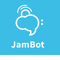

# JamBot
It's hard to communicate while jamming. JamBot helps musicians speak a universal (but silent) language.

## Overview
If you're a musician like me and you love to jam (and maybe you're even a hacker, too) then you know how hard it is to communicate ideas while jamming. The music is loud, but too good to interrupt. Your bandmates are in the pocket. But you have that itch to modulate to a minor chord. Or change up the vibe to that reggae feel. Ya Mon.

Or maybe that's not you. Perhaps you just want a nice way to organize your own notes for that cover band you're in. Keep each song with your notes on a separate vertical screen, with lyrics and special notes on horizontal screens.

Or, you're a music teacher and want to communicate your notes to the class. Or whatever!

## How it works
Using the KISS method, this runs in a browser (for now) and is based on pure HTML + JavaScript + CSS. It uses the awesome [FullPage.js](https://github.com/alvarotrigo/fullPage.js) library by [Alvaro Trigo](https://alvarotrigo.com/) (thanks @alvarotrigo!) which allows you to have multiple vertical and horizontal "FullPage" screens, and it is dependent on some kind of key-value store to keep track of the current screen, which is syncronized across any devices that have loaded the same page or a page with the same JamID. It is meant to be run on tablets, phones, TVs, laptops and anything else that supports a modern browser. Hopefully it will work on assistive devices too.

### The Key-Value Store
Initially, I set up a very basic ColdFusion (cfm) file that stored the current screen value as a server variable (it's in this repo), but to be less server dependent (and more platform independent), I went looking for a free cloud-based KVS that sports a REST API without authentication, and found https://meeiot.org/ (also available as a [repo](https://github.com/circinusX1/Free-Key-Value-Database) by @circinusX1). It's not pretty, poorly documented, and has some limitations (like you can't write within a second of reading) but at the time of this push, IT WORKS. There are many other KVS out there that are defunct or not free (keyv, keyvalue.xyz, KVStore.io, openkeyval, kvdb.io).

If you feel like adding a KVS using another platform, HMU!

### View + Controls
The viewing devices don't necessarily need to be the controlling devices. For instance, I have two smart TVs in my jam space that are running the same JamBot page, which I have configured (with css + js) to not show the menu. Additionally, I have a phone that is running a controller page (without any screens), which is set to the same jamID (see the jQ Modal Controller example). Finally, I have a tablet running the JamBot page with a full menu, subsections for lyrics, and some other goodies.

## Instructions

1. Get a Token from https://meeiot.org/?p=start.php
2. Fork this REPO and fill in the token value.

Suggested:

3. Get a license from Alvaro https://alvarotrigo.com/ (not mandatory, but his work is gold!)

## Improvements
This is my first public repo, so I'm sure I did many things wrong. Help me out! Additionally, it would be awesome to add some features...

1. Better Navigation
2. Non-Technical Screen Creation (form based)
3. Standardized Layouts (via JSON or XML) with more info (Key, Mode, Time, Tempo, Style)
4. Song Library (With Keys, Nashville Numbers or Roman Numeral Format)
   a. Common Progressions Library (I–V–vi–IV songs)
   b. Epic Jam Library (Phish's Tahoe Tweezer)
5. One-Screen Startup with Dynamic Addition (infinite scroll via Ajax)
6. Set-List Buider
7. Delay Counter Overlay (to next action such as modulate key or end the song)
8. Instrument Mode (shows different data based on instrument - sticking for drummer, chord chart for rhythm guitar, tabs for bass)

